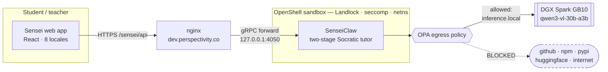

# Sensei

**Every student's personal tutor, in every language.** Running entirely on an NVIDIA DGX Spark (GB10).

One-on-one tutoring produces the largest learning effect ever measured — Bloom's two-sigma: a
tutored student outperforms 98% of classroom peers. It has also only ever been available to
families who can afford it. Sensei is that tutor for everyone else.

It teaches **Socratically** — never handing over the answer, always guiding the reasoning — and
**personally**: it remembers you're solid on mechanics, shaky on organic chemistry, three weeks
from your entrance exam, and builds today's lesson from yesterday's mistake.

A student photographs their handwritten work; the model reads the script and notation and finds
the exact step where they slipped. The tutor picks up from there.

**And it all runs on the box.** Pull the network cable — it keeps teaching.

---

## Why the Spark

Small models are fine for English chat. They fall apart at multilingual math tutoring — a 7B
model produces stilted, error-prone explanations in Bangla, Hindi, or Swahili. The GB10's 128 GB
of unified memory lets us run a 30B multimodal model locally, which is the difference between a
toy and a tutor.

And because students are minors, keeping their handwriting, mistakes, and weak spots on-device
isn't privacy theater — it's a requirement most edtech quietly violates.

## Validated on hardware

Both halves of the design were tested against a real GB10 before any code was written:

- **Socratic tutoring in Bengali** — refused to give the answer, asked two guiding questions, in
  natural Bangla.
- **Reading written work** — given a worked solution containing a sign error, it identified the
  exact line and explained the conceptual mistake.

Both from **one** model at 72 tok/s. That matters — see below.

## The constraint that shapes the architecture

The vllm router keeps **exactly one model resident**. Requesting a different model triggers a
cold swap of **1–5 minutes**, served on the same HTTP call.

So a design with "a vision model for handwriting plus a separate tutor model" would swap on every
single interaction. Sensei instead pins **one vision-capable multilingual model** that does both
jobs. Everything in `config.py` and `bootstrap_spark.sh` exists to keep that pin honest.

## Two repos

| | |
|---|---|
| **this repo** | the surfaces a student and a teacher touch — web app, mobile app, curriculum, samples, benchmark |
| [**SenseiClaw**](https://github.com/brishtiteveja/Sensei-NemoClaw) | the tutor harness: model routing, pedagogy prompts, the two-stage vision pipeline, observation store |

The web app talks to SenseiClaw and to nothing else. Its README is the reference
for the API surface, the model pin, and the two-stage design.

## How it fits together

SenseiClaw runs **inside a NemoClaw / OpenShell sandbox**. Its only route to the
network is `inference.local`, the policy-enforced path to the Spark. Everything
else — the package registries, GitHub, the open internet — fails closed. A
student's handwriting physically cannot leave the box.



The two hops that matter: nginx reaches the sandbox over OpenShell's **gRPC
service forward**, not an open port — nothing is published from the container.
And every outbound request the tutor makes passes the OPA policy, which allows
exactly one destination.

## Layout

```
web/                 Vite + React student and teacher app -- the deployed surface
  src/i18n/          8 locales; strings.ts is a module singleton (see gotcha below)
  scripts/           gen-locales.mjs, copy-samples.mjs (prebuild staging)
mobile/              Expo app
backend/sensei/      earlier standalone backend; learner.py + graph.py still live here
  learner.py         per-student memory in SQLite -- the two-sigma differentiator
  graph.py           concepts as nodes, prerequisites as edges; mastery-gated path
samples/             17 curated worked problems, rendered by scripts/render_samples.py
datasets/            NoTeS-Bank subset (ICDAR 2025, Apache-2.0) -- 39 real handwritten pages
others/hackathon/sensei/
  HANDOFF.md         current build state: verified, broken, next
  NEMOCLAW.md        sandboxed inference via NemoClaw + OpenShell
docs/
  FUTURE_PLANS.md    deferred work, with reasons
```

`backend/sensei/` predates SenseiClaw and is not what serves the app. It is kept
because `learner.py` and `graph.py` are the server-side progress model and
knowledge graph, written and not yet wired up.

## Running

The app is a static build served by nginx; **deploy means rebuild**.

```bash
cd web
VITE_SENSEI_API_URL=/sensei/api npm run build     # prebuild stages samples + notesbank
```

`VITE_SENSEI_API_URL=/sensei/api` is **mandatory**. Without it the bundle bakes in
a raw `http://<ip>:4050`, which an HTTPS page blocks as mixed content, and every
screen shows "Cannot reach the Sensei server." This has bitten twice.

### The backend

SenseiClaw runs inside the sandbox and is bridged to nginx by an OpenShell
service forward:

```bash
export NEMOCLAW_GATEWAY_PORT=8181          # 8080 is nginx on this box
scripts/sensei-sandbox-start.sh            # start the tutor inside the sandbox
scripts/sensei-backend.sh status           # what is serving :4050
```

Full setup and the traps are in
[NEMOCLAW.md](others/hackathon/sensei/NEMOCLAW.md). The service API itself is
documented in the [SenseiClaw README](https://github.com/brishtiteveja/Sensei-NemoClaw).

### Before demoing

The resident model has changed under us mid-session before, silently breaking
every vision feature. Check all three:

```bash
curl -s https://spark-e257.tail803c7f.ts.net:8443/health    # which model is hot
curl -s https://dev.perspectivity.co/sensei/api/tutor/health # tutor reachable
nemoclaw sensei exec -- curl -s -o /dev/null -w '%{http_code}' https://github.com
                                                             # must NOT be 200
```

That third line is the one worth running in front of an audience: it proves the
confinement is real rather than claimed.

### Verified confinement

From inside the sandbox — `inference.local` returns the genuine
`owned_by: "dgx-spark"` catalogue, and everything else fails closed:

| destination | result |
|---|---|
| `inference.local/v1/models` | **200** |
| `github.com` · `pypi.org` · `registry.npmjs.org` | exit 56 |
| `huggingface.co` · `clawhub.ai` · `raw.githubusercontent.com` | exit 56 |

A real `/tutor/query` through the public URL answers correctly on
`qwen3-vl-30b-a3b-gguf` in ~14 s, so the confinement costs nothing in practice.

### Gotchas

- `web/src/i18n/strings.ts` is a **module singleton**. Never hoist `t.*` into a
  module-level constant — it freezes the language at import time.
- After adding English keys, regenerate the other seven locales:
  `GEMINI_API_KEY=... node scripts/gen-locales.mjs` (incremental; missing keys only).
- nginx is shared infra and editing its config is gated, so assets are staged into
  `web/public` by a prebuild step rather than served from elsewhere.
- FastAPI request models must be declared *above* the route that uses them, or the
  body binds as a query param.

---

Built for the NVIDIA Spark Hack Series, Seattle. Lead track: **Spark**.
